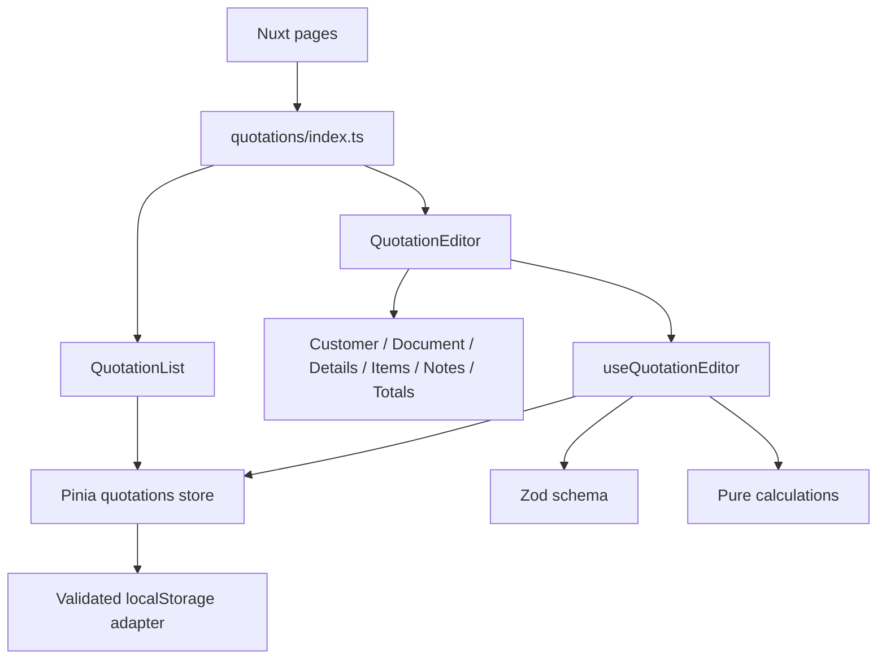

# ใบเสนอราคา: โครงสร้าง frontend

หน้าใบเสนอราคาใช้ Nuxt 4 + Vue 3 Composition API, TypeScript strict, Pinia และ Zod ตาม stack เดิม ใช้ข้อมูลตัวอย่างและ localStorage ไม่มีการเพิ่ม Go module, API contract หรือ database table

## Routes

| URL | หน้าที่ |
|---|---|
| `/` | ไปหน้ารายการใบเสนอราคา |
| `/sales/quotations` | ค้นหา กรองสถานะ เรียงวันที่ แบ่งหน้า และส่งออก CSV |
| `/sales/quotations/new` | สร้างใบเสนอราคา |
| `/sales/quotations/:id` | เปิดแก้ไขเอกสารที่บันทึกไว้ |

หน้า list ใช้ default layout ที่มี SalesNavigation; หน้าสร้าง/แก้ไขใช้ document layout เพื่อให้พื้นที่กับตารางสินค้า

## แยกความรับผิดชอบ

| ตำแหน่งใต้ `apps/web/app/` | แก้อะไรที่นี่ |
|---|---|
| `components/layout/SalesNavigation.vue` | เมนูหลัก/เมนูย่อยและเมนูมือถือ |
| `constants/sales-navigation.ts` | รายการเมนูขายทั้ง 7 ประเภท |
| `pages/sales/[document].vue` | หน้ารองรับเมนูอีก 6 ประเภทที่รอรายละเอียด |
| `components/base/AppDropdown.vue`, `AppDialog.vue` | dropdown ที่ไม่ถูก table overflow ตัด, keyboard/focus และ modal dialog |
| `components/base/AppIcon.vue`, `FormField.vue` | ไอคอนและ label/error ของช่องกรอก |
| `features/quotations/components/QuotationList.vue` | การเลือกข้อมูลแสดงผลและ pagination |
| `QuotationListToolbar.vue`, `QuotationTable.vue`, `QuotationStatusBadge.vue` ใน feature components | ตัวกรอง ช่องค้นหา แถวตาราง และ badge |
| `QuotationEditor.vue` | ประกอบ section, submit, unsaved-change guard และ print action |
| `QuotationCustomerSection.vue` | ชื่อลูกค้า ที่อยู่ เลขผู้เสียภาษี และสาขา |
| `QuotationDocumentSection.vue` | วันที่ เครดิต ครบกำหนด พนักงานขาย และยอดด้านบน |
| `QuotationCreditField.vue` | ช่องจำนวนวันและ dropdown ประเภทเครดิต 3 แบบ พร้อม keyboard/outside-click handling |
| `QuotationDetailsSection.vue` | โปรเจ็กต์ อ้างอิง คลังสินค้า และโหมดภาษี |
| `QuotationItemsTable.vue` | ช่องกรอกในแต่ละรายการและ event เพิ่ม/ลบ |
| `QuotationTotals.vue` | ส่วนลดเพิ่มเติมและการแสดงสรุปยอด |
| `QuotationNotesSection.vue` | หมายเหตุบนเอกสารและโน้ตภายใน |
| `QuotationPrintPreview.vue` | เอกสารสำหรับพิมพ์/PDF; ไม่รับแสดงโน้ตภายใน |
| `QuotationStatusMenu.vue`, `QuotationActionsMenu.vue` | รายการสถานะและเมนูจัดการต่อเอกสาร |
| `QuotationPrintBatch.vue`, `QuotationShareDialog.vue` | เอกสารพิมพ์หลายใบ/ซอง และ dialog แชร์ไฟล์ |
| `features/quotations/composables/useQuotationActions.ts` | ประสาน PDF, print, status, duplicate, delete และ error/busy state |
| `features/quotations/services/pdf-definition.ts`, `pdf.ts` | โครงสร้าง PDF ที่ไม่มีโน้ตภายใน และ lazy-loaded browser PDF adapter |
| `features/quotations/composables/useQuotationEditor.ts` | lifecycle ของ draft, validation, error state และเรียก save |
| `features/quotations/stores/quotations.ts` | Pinia state ของเอกสารที่บันทึกแล้วและหมายเลขเอกสาร |
| `features/quotations/services/calculations.ts` | ฟังก์ชันคำนวณที่ไม่มี dependency ต่อ Vue/browser |
| `features/quotations/services/credit-terms.ts` | คำนวณวันเครดิต/วันครบกำหนดและเปลี่ยนประเภทเครดิตแบบ atomic patch |
| `features/quotations/services/fixtures.ts` | เปลี่ยนตัวอย่างลูกค้า สินค้า และเอกสาร |
| `features/quotations/services/storage.ts` | อ่าน/เขียนและตรวจรูปแบบ localStorage |
| `features/quotations/services/export.ts` | สร้าง CSV และดาวน์โหลดไฟล์ |
| `features/quotations/schemas/quotation.ts` | กฎ validation ที่ใช้ทั้ง form และ storage |
| `features/quotations/types/index.ts` | TypeScript types ของ feature |
| `assets/main.css` | สี spacing ตาราง responsive และ print styles |

หน้าภายนอก feature import ผ่าน `features/quotations/index.ts` เท่านั้น แต่ละ SFC ใช้ `<script setup lang="ts">`, typed props/emits และ `defineModel` สำหรับค่าที่สองฝั่งต้องแก้ร่วมกัน Section ไม่แก้ props object โดยตรง: emit patch หรือส่ง object/array ใหม่กลับไปยังเจ้าของ state



## ข้อมูลและการคำนวณตัวอย่าง

State ฝั่ง SSR เริ่มด้วย fixtures ที่แน่นอน แล้ว hydrate localStorage หลัง mounted เพื่อหลีกเลี่ยง hydration mismatch การแก้เอกสารใช้สำเนาแยกจาก saved state; บันทึก storage สำเร็จก่อนอัปเดต Pinia และแสดง success ถ้า storage เต็มหรือถูกปิด ระบบแสดง error

ฟอร์มและส่วนควบคุมรอ mounted ก่อนรับการกด/กรอกด้วย `inert` เพื่อไม่ให้ข้อมูลหายหรือ submit ก่อน hydration เสร็จ ตารางกว้างเลื่อนภายใน wrapper ที่กำหนด `position: relative` เพื่อไม่ให้ label แบบ `sr-only` ทำให้หน้ามือถือล้นด้านข้าง เมนูมือถือที่ปิดอยู่ใช้ `visibility: hidden` เพื่อไม่ให้ keyboard focus ไปยังเมนูนอกจอ

ยอดที่คำนวณทุกค่ามีหน่วยเป็นสตางค์ ปัดเศษต่อรายการ ใช้ส่วนลดเปอร์เซ็นต์ของบรรทัดก่อนแบ่งส่วนลดเพิ่มเติมเป็นจำนวนเงินตามสัดส่วน แล้วคำนวณ VAT/หัก ณ ที่จ่ายจากราคาหลังลด โหมดรวมภาษีแยก VAT ออกจากราคาที่กรอก ตัวเลขนี้เป็น convention ของตัวอย่าง UI; เมื่อต่อ API จริงให้ backend ตรวจและคำนวณยอดใหม่

CSV escape เครื่องหมาย quote และป้องกันข้อความจากผู้ใช้ถูกตีความเป็น spreadsheet formula การพิมพ์ใช้ component แยกจากฟอร์มและไม่มีโน้ตภายใน PDF ใช้ pdfmake 0.3 พร้อมฟอนต์ Sarabun/OFL ที่เสิร์ฟจาก origin ของแอป รองรับหลายเอกสารและ table pagination การแชร์ใช้ Web Share API ส่ง File หลังผู้ใช้กดปุ่ม หากเบราว์เซอร์ไม่รองรับให้ดาวน์โหลด PDF เอกสารสาธิตไม่มีลายเซ็นจริงหรือบริการ upload

สถานะเปลี่ยนผ่าน store และตรวจ schema ก่อนบันทึก การลบ/สร้างซ้ำใช้ persist-before-state เช่นเดียวกับ save; เมื่อพื้นที่จัดเก็บปฏิเสธการเขียน state เดิมยังอยู่ การลบมี dialog ยืนยัน และ list ปรับ pagination/selection หลังข้อมูลเปลี่ยน คำสั่งสร้างเอกสารประเภทอื่นยัง disabled ตามขอบเขตที่ผู้ใช้ขอเพียงเมนูไว้ก่อน

อ้างอิง PDF: [pdfmake client-side](https://pdfmake.github.io/docs/0.3/getting-started/client-side/) และ [custom font URLs](https://pdfmake.github.io/docs/0.3/fonts/custom-fonts-client-side/url/) ฟอนต์มาจาก [Google Fonts Sarabun](https://github.com/google/fonts/tree/main/ofl/sarabun) และแนบ OFL.txt ใน public/fonts/sarabun

## ตรวจงาน

เครดิตใช้ `creditMode` เป็น `days`, `cash` หรือ `undated` และบันทึก `dueDate` จริง เมื่อเปลี่ยนจำนวนวันหรือวันที่เอกสารจะคำนวณวันครบกำหนดใหม่ การแก้วันครบกำหนดจะคำนวณจำนวนวันกลับด้วย UTC date-only arithmetic รองรับ 0–365 วัน เงินสดเป็น 0 วัน เงินสดและเครดิตไม่แสดงวันที่ซ่อนวันครบกำหนดในฟอร์ม/พิมพ์ Zod เติมค่าเฉพาะ field ที่ขาดให้เอกสารเดิม โดยใช้โหมด days และวันเดิมบวกจำนวนวันเครดิต ไม่เขียนทับวันครบกำหนดที่เคยแก้ไว้

```sh
pnpm lint
pnpm typecheck
pnpm test
pnpm build
PLAYWRIGHT_BASE_URL=http://127.0.0.1:33000 pnpm test:e2e
```

Unit tests ตรวจเงินรวม ภาษี ส่วนลด การปัดเศษ validation วันที่ และ storage E2E ตรวจสร้าง → คำนวณ → บันทึก → reload → ค้นหา → แก้ไข รวมถึง empty state, print privacy และ mobile overflow

อ้างอิงแนวทางจาก [Vue component v-model](https://vuejs.org/guide/components/v-model.html) และ [Pinia with Nuxt](https://pinia.vuejs.org/ssr/nuxt.html)
